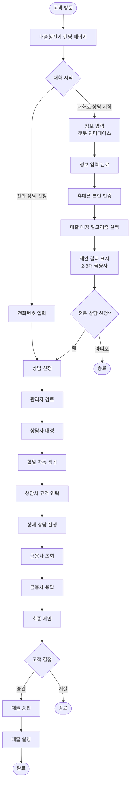
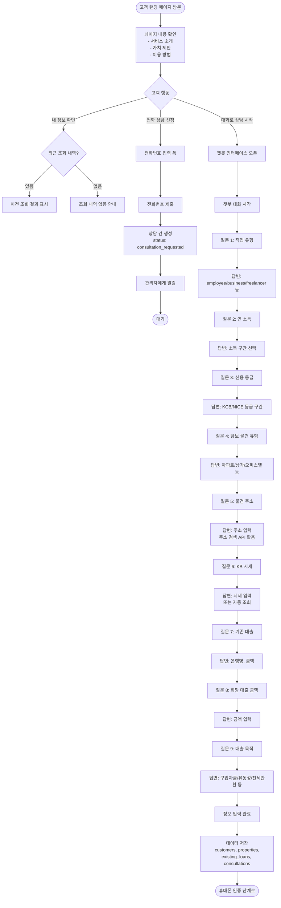
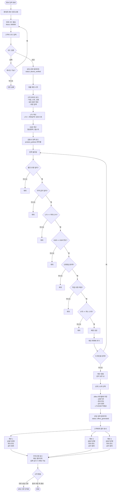
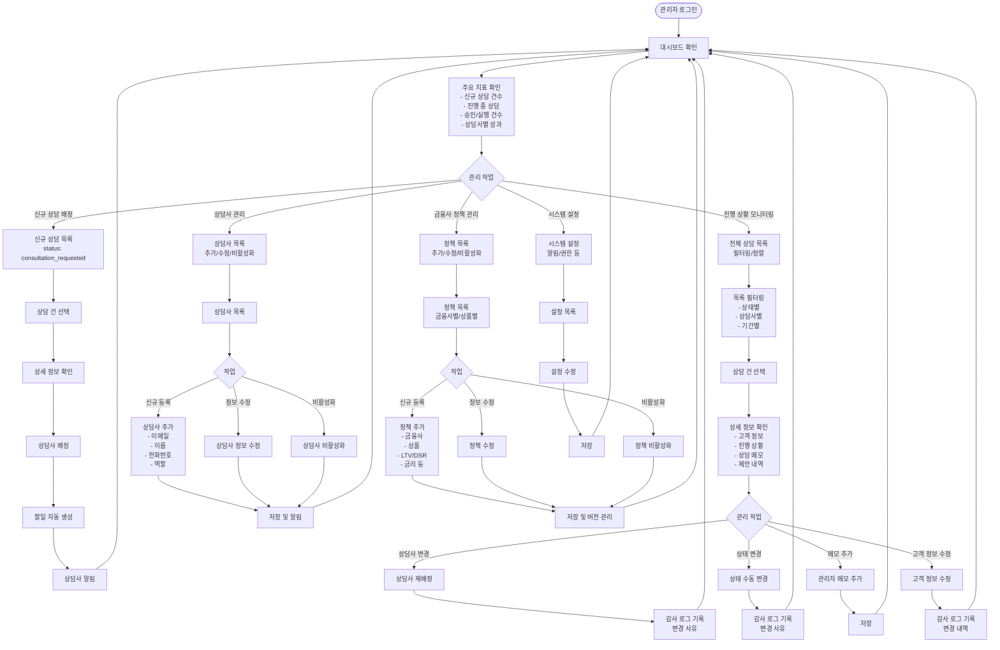
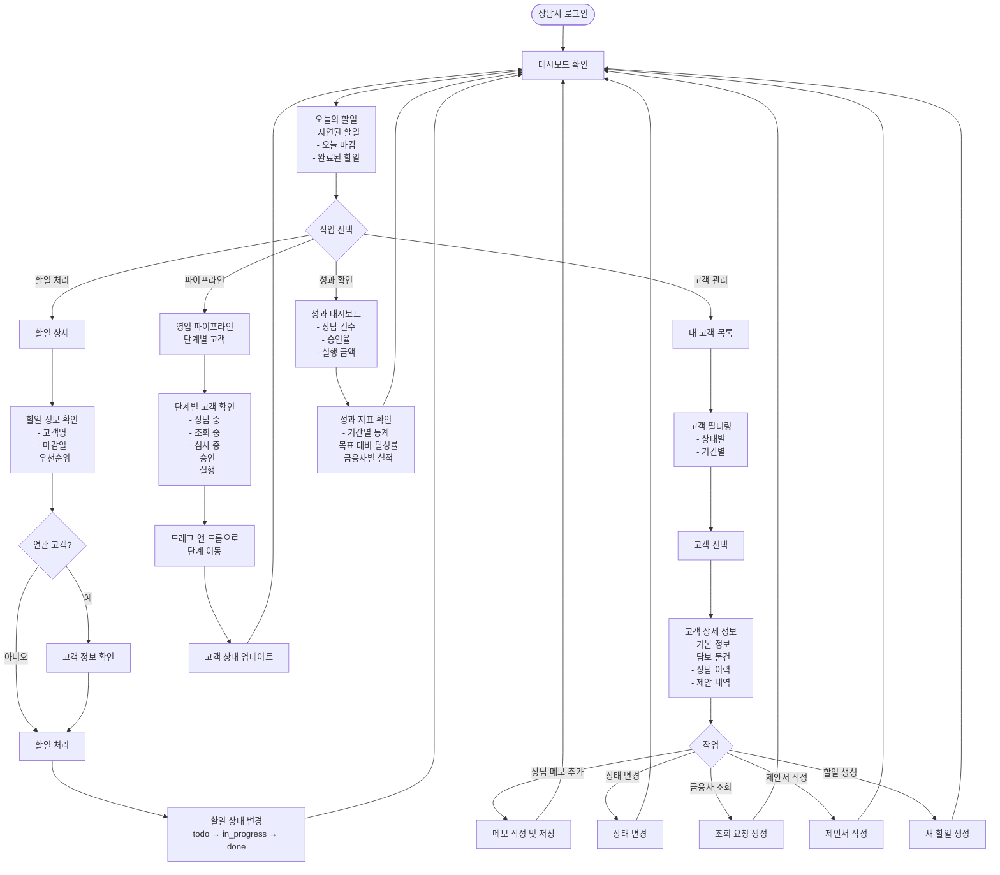
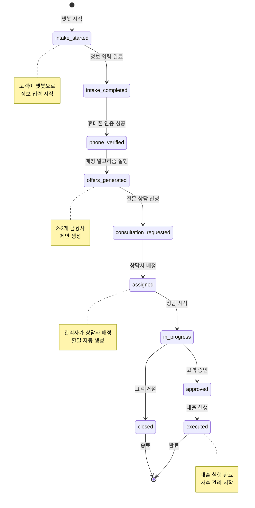
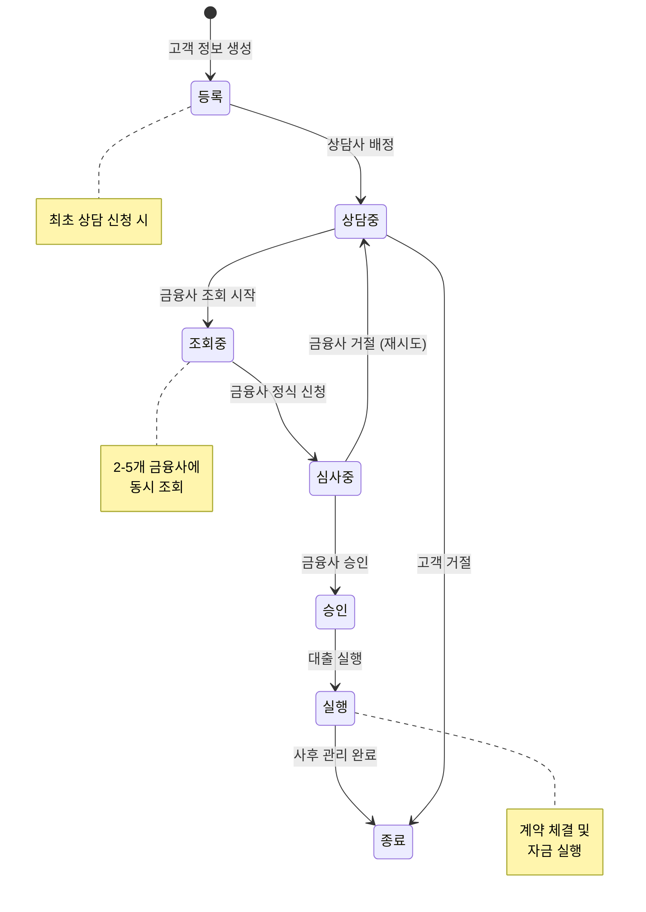
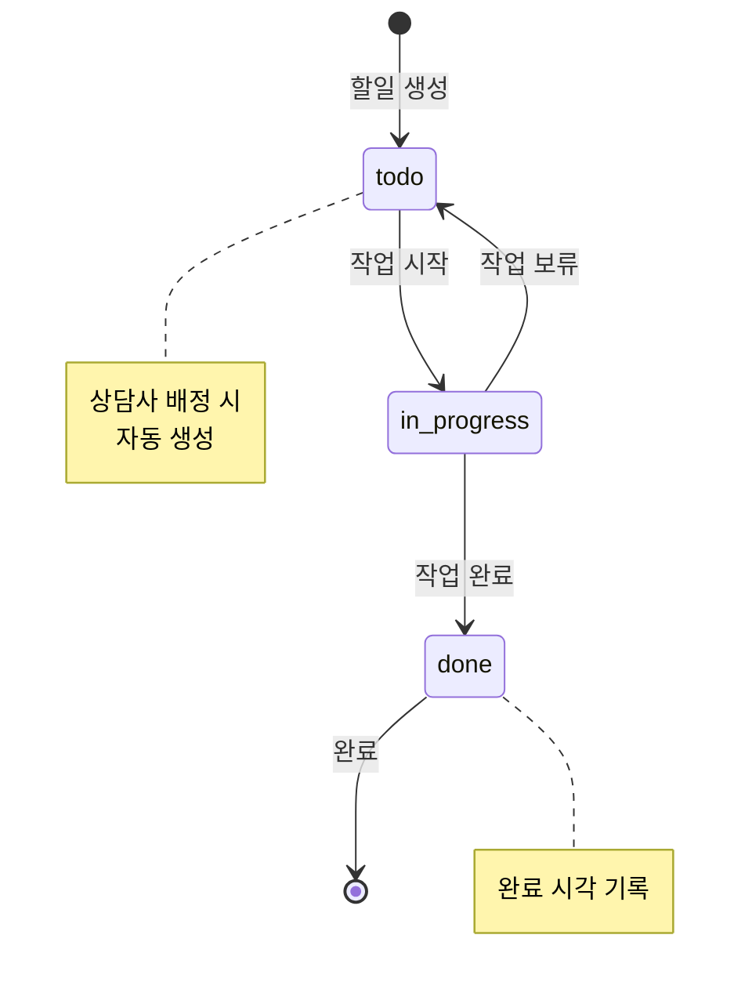
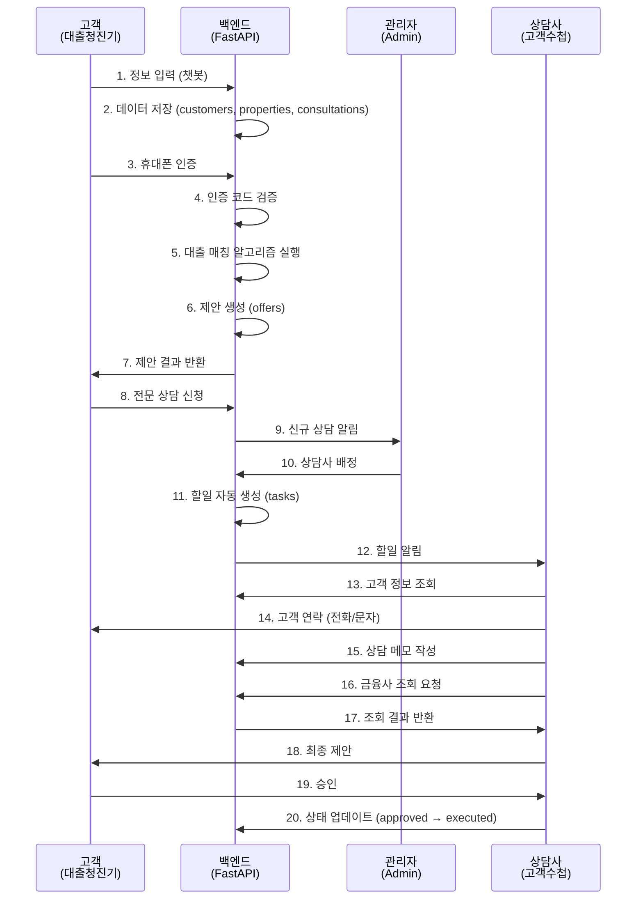

# 대출청진기 - 담보대출 상담 프로세스 플로우차트

## 1. 전체 프로세스 개요

담보대출 상담 프로세스는 크게 3개의 주요 단계로 구성됩니다:
1. **고객 접수 단계** (Customer Intake)
2. **대출 매칭 및 제안 단계** (Loan Matching & Offers)
3. **상담 및 실행 단계** (Consultation & Execution)

---

## 2. 상세 프로세스 플로우차트

### 2.1 전체 워크플로우 (High-Level)

---

### 2.2 고객 접수 단계 (Customer Intake)

---

### 2.3 대출 매칭 및 제안 단계 (Loan Matching)

---

### 2.4 상담 및 실행 단계 (Consultation & Execution)

```mermaid
flowchart TD
    Start([고객이 전문 상담 신청]) --> UpdateStatus1[상담 상태 업데이트<br/>status: consultation_requested]
    
    UpdateStatus1 --> NotifyAdmin[관리자에게 알림<br/>신규 상담 건 발생]
    
    NotifyAdmin --> AdminLogin[관리자 Admin 페이지 로그인]
    AdminLogin --> ViewDashboard[대시보드 확인<br/>신규 상담 건 목록]
    
    ViewDashboard --> SelectConsult[상담 건 선택]
    SelectConsult --> ViewDetails[상세 정보 확인<br/>- 고객 정보<br/>- 담보 물건<br/>- 제안된 상품<br/>- 매칭 결과]
    
    ViewDetails --> AssignDecision{상담사 배정}
    
    AssignDecision --> SelectConsultant[상담사 선택<br/>- 지역별<br/>- 업무량별<br/>- 전문성별]
    
    SelectConsultant --> UpdateAssignment[상담 정보 업데이트<br/>consultant_id 설정<br/>status: assigned]
    
    UpdateAssignment --> CreateTask[할일 자동 생성<br/>- 제목: 고객명 상담<br/>- 담당자: 배정된 상담사<br/>- 마감일: D+1<br/>- 우선순위: high]
    
    CreateTask --> NotifyConsultant[상담사에게 알림<br/>새 할일 배정]
    
    NotifyConsultant --> ConsultantView[상담사 할일 확인<br/>고객수첩 또는 Admin]
    
    ConsultantView --> ContactCustomer[고객에게 연락<br/>전화 또는 문자]
    
    ContactCustomer --> UpdateStatus2[상담 상태 업데이트<br/>status: in_progress]
    
    UpdateStatus2 --> DetailedConsult[상세 상담 진행<br/>- 추가 정보 확인<br/>- 고객 니즈 파악<br/>- 서류 안내]
    
    DetailedConsult --> AddMemo1[상담 메모 작성<br/>consultation_memos]
    
    AddMemo1 --> NeedInquiry{금융사 조회 필요?}
    
    NeedInquiry -->|아니오| DirectProposal[기존 제안으로 진행]
    NeedInquiry -->|예| CreateInquiry[조회 요청 생성<br/>inquiry_requests]
    
    CreateInquiry --> SelectInstitutions[조회 대상 금융사 선택<br/>2-5개 금융사]
    SelectInstitutions --> SendInquiry[금융사에 조회 요청<br/>- 고객 정보<br/>- 담보 정보<br/>- 희망 금액]
    
    SendInquiry --> WaitResponse[금융사 응답 대기]
    WaitResponse --> ReceiveResponse[응답 수신<br/>inquiry_responses<br/>- 최대 한도<br/>- 금리]
    
    ReceiveResponse --> CompareOffers[제안 비교 분석]
    CompareOffers --> AddMemo2[상담 메모 추가<br/>조회 결과 정리]
    
    DirectProposal --> PrepareProposal[최종 제안서 준비]
    AddMemo2 --> PrepareProposal
    
    PrepareProposal --> PresentToCustomer[고객에게 제안<br/>- 추천 금융사<br/>- 예상 한도<br/>- 예상 금리<br/>- 필요 서류<br/>- 진행 절차]
    
    PresentToCustomer --> CustomerReview[고객 검토]
    CustomerReview --> CustomerDecision{고객 결정}
    
    CustomerDecision -->|진행| Approval[고객 승인]
    CustomerDecision -->|보류| Hold[보류 처리<br/>추가 상담 예약]
    CustomerDecision -->|거절| Reject[거절 처리<br/>status: closed]
    
    Hold --> AddMemo3[상담 메모 추가<br/>보류 사유]
    AddMemo3 --> FollowUp[후속 조치 할일 생성]
    FollowUp --> End1([대기])
    
    Reject --> AddMemo4[상담 메모 추가<br/>거절 사유]
    AddMemo4 --> CloseTask[할일 완료 처리]
    CloseTask --> End2([종료])
    
    Approval --> UpdateStatus3[상담 상태 업데이트<br/>status: approved]
    UpdateStatus3 --> PrepareDocuments[서류 준비 안내<br/>- 신분증<br/>- 등기부등본<br/>- 소득 증빙<br/>- 재직 증명]
    
    PrepareDocuments --> SubmitToBank[금융사 정식 신청]
    SubmitToBank --> BankReview[금융사 심사]
    BankReview --> BankDecision{금융사 승인?}
    
    BankDecision -->|거절| BankReject[금융사 거절<br/>다른 금융사 시도]
    BankDecision -->|승인| BankApproval[금융사 승인]
    
    BankReject --> AddMemo5[상담 메모 추가<br/>거절 사유]
    AddMemo5 --> TryOther{다른 금융사 시도?}
    TryOther -->|예| SendInquiry
    TryOther -->|아니오| FinalReject[최종 거절<br/>status: closed]
    FinalReject --> End3([종료])
    
    BankApproval --> UpdateStatus4[상담 상태 업데이트<br/>status: executed]
    UpdateStatus4 --> LoanExecution[대출 실행<br/>- 계약 체결<br/>- 자금 실행]
    
    LoanExecution --> AddMemo6[상담 메모 추가<br/>실행 완료]
    AddMemo6 --> CompleteTask[할일 완료 처리]
    CompleteTask --> UpdateCustomer[고객 상태 업데이트<br/>status: 실행]
    
    UpdateCustomer --> FollowUpService[사후 관리<br/>- 만족도 조사<br/>- 추가 니즈 확인]
    
    FollowUpService --> End4([완료])
```

---

### 2.5 관리자 워크플로우

---

### 2.6 상담사 워크플로우 (고객수첩)

---

## 3. 상태 전이 다이어그램 (State Transition)

### 3.1 상담 상태 (consultations.status)

### 3.2 고객 상태 (customers.status)

### 3.3 할일 상태 (tasks.status)

---

## 4. 시스템 간 상호작용 다이어그램

### 4.1 고객 - 백엔드 - 관리자 상호작용

---

## 5. 주요 비즈니스 규칙

### 5.1 대출 매칭 규칙
1. **LTV (Loan to Value)**: 희망 금액 / 담보 시세
   - 은행: 최대 70%
   - 비은행: 최대 80%
   - 물건 유형 및 급지에 따라 차등

2. **DSR (Debt Service Ratio)**: 총 부채 원리금 상환액 / 연 소득
   - 은행: 최대 40%
   - 비은행: 최대 50%

3. **신용 등급**: 금융사별 최소 요구 등급
   - 은행: KCB 700+ 또는 NICE 700+
   - 비은행: KCB 600+ 또는 NICE 600+

4. **직업 유형**: 금융사별 허용 직업
   - 은행: 직장인, 사업자
   - 비은행: 직장인, 사업자, 프리랜서

5. **소득**: 금융사별 최소 소득
   - 은행: 연 2,400만원 이상
   - 비은행: 연 1,800만원 이상

### 5.2 상담 배정 규칙
1. **지역별 배정**: 담보 물건 지역과 상담사 담당 지역 매칭
2. **업무량 균등**: 진행 중인 상담 건수 고려
3. **전문성**: 물건 유형별 전문 상담사 우선 배정
4. **우선순위**: 고액 상담 건은 시니어 상담사 배정

### 5.3 할일 생성 규칙
1. **자동 생성**: 상담사 배정 시 자동으로 할일 생성
2. **마감일**: 배정일 기준 D+1 (영업일)
3. **우선순위**: 
   - 고액 (1억 이상): high
   - 중액 (5천만~1억): medium
   - 소액 (5천만 미만): low

### 5.4 감사 로그 규칙
1. **필수 기록 대상**:
   - 고객 정보 생성/수정/삭제
   - 상담사 배정/변경
   - 상담 상태 변경
   - 금융사 조회 요청/응답
   - 대출 승인/실행

2. **보관 기간**: 최소 1년 (법적 요구사항에 따라 연장)

---

## 6. 예외 처리 및 에러 시나리오

### 6.1 고객 입력 단계
- **불완전한 정보**: 필수 항목 미입력 시 진행 불가 안내
- **인증 실패**: 3회 실패 시 전화 상담 안내
- **매칭 결과 없음**: "조건에 맞는 금융사가 없습니다. 전문 상담을 신청하시겠습니까?"

### 6.2 상담 진행 단계
- **상담사 부재**: 관리자에게 알림, 다른 상담사 재배정
- **금융사 조회 실패**: 재시도 또는 다른 금융사 조회
- **고객 연락 불가**: 문자 발송, 재연락 할일 생성

### 6.3 시스템 오류
- **API 타임아웃**: 재시도 로직 (최대 3회)
- **데이터 저장 실패**: 트랜잭션 롤백, 에러 로그 기록
- **외부 API 장애**: Mock 데이터로 대체 또는 수동 처리 안내

---

## 7. 성과 지표 (KPI)

### 7.1 고객 관련
- **전환율**: 방문자 대비 상담 신청 비율
- **완료율**: 상담 신청 대비 대출 실행 비율
- **평균 처리 시간**: 상담 신청부터 대출 실행까지 소요 시간

### 7.2 상담사 관련
- **상담 건수**: 상담사별 월간 상담 건수
- **승인율**: 상담 건수 대비 승인 건수
- **실행 금액**: 상담사별 월간 실행 금액

### 7.3 금융사 관련
- **조회 건수**: 금융사별 조회 요청 건수
- **승인율**: 금융사별 승인 비율
- **평균 금리**: 금융사별 평균 적용 금리

---

이 플로우차트와 프로세스 설명으로 담보대출 상담 업무를 이해하셨나요? 
추가 질문이나 수정 사항이 있으면 말씀해주세요!
