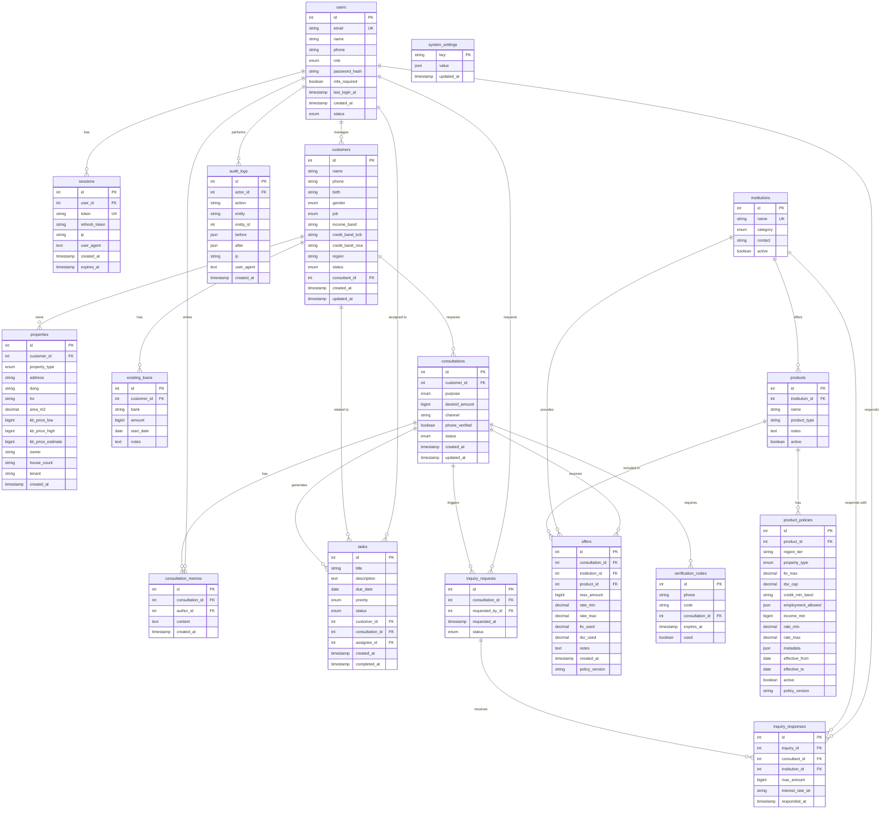

# 대출청진기 - 상세 DB 스키마 및 ERD

## 1. 데이터베이스 전체 테이블 목록

### 1.1 사용자 및 인증 (2개 테이블)
- `users` - 사용자 (관리자, 상담사)
- `sessions` - 로그인 세션

### 1.2 고객 및 상담 (5개 테이블)
- `customers` - 고객 기본 정보
- `properties` - 담보 물건 정보
- `existing_loans` - 기존 대출 정보
- `consultations` - 상담 건
- `consultation_memos` - 상담 메모

### 1.3 금융 상품 및 정책 (4개 테이블)
- `institutions` - 금융기관
- `products` - 금융 상품
- `product_policies` - 상품별 정책 (LTV, DSR 등)
- `offers` - 고객별 대출 제안

### 1.4 업무 관리 (3개 테이블)
- `tasks` - 할일
- `inquiry_requests` - 금융사 조회 요청
- `inquiry_responses` - 금융사 조회 응답

### 1.5 시스템 (3개 테이블)
- `verification_codes` - 휴대폰 인증 코드
- `audit_logs` - 감사 로그
- `system_settings` - 시스템 설정

**총 17개 테이블**

---

## 2. 상세 테이블 스키마

### 2.1 users (사용자)

| 컬럼명 | 데이터 타입 | 제약조건 | 설명 |
|--------|------------|---------|------|
| id | INTEGER | PRIMARY KEY, AUTO_INCREMENT | 사용자 ID |
| email | VARCHAR(255) | UNIQUE, NOT NULL | 이메일 (로그인 ID) |
| name | VARCHAR(100) | NOT NULL | 이름 |
| phone | VARCHAR(20) | NULL | 전화번호 |
| role | ENUM('super_admin', 'admin', 'consultant') | NOT NULL | 역할 |
| password_hash | VARCHAR(255) | NOT NULL | 비밀번호 해시 |
| mfa_required | BOOLEAN | DEFAULT FALSE | MFA 필수 여부 |
| last_login_at | TIMESTAMP | NULL | 마지막 로그인 시각 |
| created_at | TIMESTAMP | DEFAULT CURRENT_TIMESTAMP | 생성 시각 |
| status | ENUM('active', 'inactive') | DEFAULT 'active' | 상태 |

**인덱스:**
- PRIMARY KEY: `id`
- UNIQUE INDEX: `email`
- INDEX: `role`, `status`

---

### 2.2 sessions (세션)

| 컬럼명 | 데이터 타입 | 제약조건 | 설명 |
|--------|------------|---------|------|
| id | INTEGER | PRIMARY KEY, AUTO_INCREMENT | 세션 ID |
| user_id | INTEGER | FOREIGN KEY → users(id), NOT NULL | 사용자 ID |
| token | VARCHAR(255) | UNIQUE, NOT NULL | 액세스 토큰 |
| refresh_token | VARCHAR(255) | UNIQUE, NULL | 리프레시 토큰 |
| ip | VARCHAR(45) | NULL | IP 주소 |
| user_agent | TEXT | NULL | User Agent |
| created_at | TIMESTAMP | DEFAULT CURRENT_TIMESTAMP | 생성 시각 |
| expires_at | TIMESTAMP | NOT NULL | 만료 시각 |

**인덱스:**
- PRIMARY KEY: `id`
- UNIQUE INDEX: `token`
- INDEX: `user_id`, `expires_at`

---

### 2.3 customers (고객)

| 컬럼명 | 데이터 타입 | 제약조건 | 설명 |
|--------|------------|---------|------|
| id | INTEGER | PRIMARY KEY, AUTO_INCREMENT | 고객 ID |
| name | VARCHAR(100) | NOT NULL | 이름 |
| phone | VARCHAR(20) | NOT NULL | 전화번호 |
| birth | VARCHAR(10) | NULL | 생년월일 (YYYY-MM-DD) |
| gender | ENUM('male', 'female', 'other') | NULL | 성별 |
| job | ENUM('employee', 'business', 'freelancer', 'housewife', 'unemployed', 'other') | NULL | 직업 |
| income_band | VARCHAR(50) | NULL | 소득 구간 (예: "2400-5000만원") |
| credit_band_kcb | VARCHAR(20) | NULL | KCB 신용 등급 구간 (예: "700+") |
| credit_band_nice | VARCHAR(20) | NULL | NICE 신용 등급 구간 (예: "700+") |
| region | VARCHAR(50) | NULL | 지역 (예: "서울", "경기") |
| status | ENUM('등록', '상담중', '조회중', '심사중', '승인', '실행', '종료') | DEFAULT '등록' | 진행 상태 |
| consultant_id | INTEGER | FOREIGN KEY → users(id), NULL | 담당 상담사 ID |
| created_at | TIMESTAMP | DEFAULT CURRENT_TIMESTAMP | 생성 시각 |
| updated_at | TIMESTAMP | DEFAULT CURRENT_TIMESTAMP ON UPDATE CURRENT_TIMESTAMP | 수정 시각 |

**인덱스:**
- PRIMARY KEY: `id`
- INDEX: `phone`, `consultant_id`, `status`, `created_at`

---

### 2.4 properties (담보 물건)

| 컬럼명 | 데이터 타입 | 제약조건 | 설명 |
|--------|------------|---------|------|
| id | INTEGER | PRIMARY KEY, AUTO_INCREMENT | 물건 ID |
| customer_id | INTEGER | FOREIGN KEY → customers(id), NOT NULL | 고객 ID |
| property_type | ENUM('apartment', 'commercial', 'officetel', 'villa', 'house', 'other') | NOT NULL | 물건 유형 |
| address | VARCHAR(255) | NOT NULL | 주소 |
| dong | VARCHAR(50) | NULL | 동 |
| ho | VARCHAR(50) | NULL | 호 |
| area_m2 | DECIMAL(10,2) | NULL | 면적 (㎡) |
| kb_price_low | BIGINT | NULL | KB 시세 하한 (만원) |
| kb_price_high | BIGINT | NULL | KB 시세 상한 (만원) |
| kb_price_estimate | BIGINT | NULL | KB 시세 예상 (만원) |
| owner | VARCHAR(100) | NULL | 소유자 |
| house_count | VARCHAR(20) | NULL | 주택 수 |
| tenant | VARCHAR(100) | NULL | 임차인 |
| created_at | TIMESTAMP | DEFAULT CURRENT_TIMESTAMP | 생성 시각 |

**인덱스:**
- PRIMARY KEY: `id`
- INDEX: `customer_id`, `property_type`

---

### 2.5 existing_loans (기존 대출)

| 컬럼명 | 데이터 타입 | 제약조건 | 설명 |
|--------|------------|---------|------|
| id | INTEGER | PRIMARY KEY, AUTO_INCREMENT | 대출 ID |
| customer_id | INTEGER | FOREIGN KEY → customers(id), NOT NULL | 고객 ID |
| bank | VARCHAR(100) | NOT NULL | 은행명 |
| amount | BIGINT | NOT NULL | 대출 금액 (만원) |
| start_date | DATE | NULL | 대출 시작일 |
| notes | TEXT | NULL | 비고 |

**인덱스:**
- PRIMARY KEY: `id`
- INDEX: `customer_id`

---

### 2.6 consultations (상담)

| 컬럼명 | 데이터 타입 | 제약조건 | 설명 |
|--------|------------|---------|------|
| id | INTEGER | PRIMARY KEY, AUTO_INCREMENT | 상담 ID |
| customer_id | INTEGER | FOREIGN KEY → customers(id), NOT NULL | 고객 ID |
| purpose | ENUM('purchase', 'liquidity', 'debt_consolidation', 'lease_return', 'other') | NULL | 대출 목적 |
| desired_amount | BIGINT | NULL | 희망 금액 (만원) |
| channel | VARCHAR(50) | NULL | 유입 채널 |
| phone_verified | BOOLEAN | DEFAULT FALSE | 휴대폰 인증 여부 |
| status | ENUM('intake_started', 'intake_completed', 'phone_verified', 'offers_generated', 'consultation_requested', 'assigned', 'in_progress', 'approved', 'executed', 'closed') | DEFAULT 'intake_started' | 상담 상태 |
| created_at | TIMESTAMP | DEFAULT CURRENT_TIMESTAMP | 생성 시각 |
| updated_at | TIMESTAMP | DEFAULT CURRENT_TIMESTAMP ON UPDATE CURRENT_TIMESTAMP | 수정 시각 |

**인덱스:**
- PRIMARY KEY: `id`
- INDEX: `customer_id`, `status`, `created_at`

---

### 2.7 consultation_memos (상담 메모)

| 컬럼명 | 데이터 타입 | 제약조건 | 설명 |
|--------|------------|---------|------|
| id | INTEGER | PRIMARY KEY, AUTO_INCREMENT | 메모 ID |
| consultation_id | INTEGER | FOREIGN KEY → consultations(id), NOT NULL | 상담 ID |
| author_id | INTEGER | FOREIGN KEY → users(id), NOT NULL | 작성자 ID |
| content | TEXT | NOT NULL | 메모 내용 |
| created_at | TIMESTAMP | DEFAULT CURRENT_TIMESTAMP | 생성 시각 |

**인덱스:**
- PRIMARY KEY: `id`
- INDEX: `consultation_id`, `author_id`

---

### 2.8 institutions (금융기관)

| 컬럼명 | 데이터 타입 | 제약조건 | 설명 |
|--------|------------|---------|------|
| id | INTEGER | PRIMARY KEY, AUTO_INCREMENT | 금융기관 ID |
| name | VARCHAR(100) | UNIQUE, NOT NULL | 금융기관명 |
| category | ENUM('bank', 'nonbank', 'insurance', 'p2p') | NOT NULL | 카테고리 |
| contact | VARCHAR(100) | NULL | 연락처 |
| active | BOOLEAN | DEFAULT TRUE | 활성 여부 |

**인덱스:**
- PRIMARY KEY: `id`
- UNIQUE INDEX: `name`
- INDEX: `category`, `active`

---

### 2.9 products (금융 상품)

| 컬럼명 | 데이터 타입 | 제약조건 | 설명 |
|--------|------------|---------|------|
| id | INTEGER | PRIMARY KEY, AUTO_INCREMENT | 상품 ID |
| institution_id | INTEGER | FOREIGN KEY → institutions(id), NOT NULL | 금융기관 ID |
| name | VARCHAR(200) | NOT NULL | 상품명 |
| product_type | VARCHAR(50) | NULL | 상품 유형 |
| notes | TEXT | NULL | 비고 |
| active | BOOLEAN | DEFAULT TRUE | 활성 여부 |

**인덱스:**
- PRIMARY KEY: `id`
- INDEX: `institution_id`, `active`

---

### 2.10 product_policies (상품 정책)

| 컬럼명 | 데이터 타입 | 제약조건 | 설명 |
|--------|------------|---------|------|
| id | INTEGER | PRIMARY KEY, AUTO_INCREMENT | 정책 ID |
| product_id | INTEGER | FOREIGN KEY → products(id), NOT NULL | 상품 ID |
| region_tier | VARCHAR(10) | NULL | 급지 (A, B, C 등) |
| property_type | ENUM('apartment', 'commercial', 'officetel', 'villa', 'house', 'other', 'all') | DEFAULT 'all' | 물건 유형 |
| ltv_max | DECIMAL(5,4) | NULL | 최대 LTV (예: 0.7000 = 70%) |
| dsr_cap | DECIMAL(5,4) | NULL | DSR 한도 (예: 0.4000 = 40%) |
| credit_min_band | VARCHAR(20) | NULL | 최소 신용 등급 (예: "KCB700+") |
| employment_allowed | JSON | NULL | 허용 직업 유형 (예: ["employee","business"]) |
| income_min | BIGINT | NULL | 최소 소득 (만원/년) |
| rate_min | DECIMAL(6,4) | NULL | 최소 금리 (예: 0.0450 = 4.5%) |
| rate_max | DECIMAL(6,4) | NULL | 최대 금리 (예: 0.0650 = 6.5%) |
| metadata | JSON | NULL | 추가 규칙 (JSON) |
| effective_from | DATE | NULL | 시행일 |
| effective_to | DATE | NULL | 종료일 |
| active | BOOLEAN | DEFAULT TRUE | 활성 여부 |
| policy_version | VARCHAR(50) | NULL | 정책 버전 |

**인덱스:**
- PRIMARY KEY: `id`
- INDEX: `product_id`, `active`, `effective_from`, `effective_to`

---

### 2.11 offers (대출 제안)

| 컬럼명 | 데이터 타입 | 제약조건 | 설명 |
|--------|------------|---------|------|
| id | INTEGER | PRIMARY KEY, AUTO_INCREMENT | 제안 ID |
| consultation_id | INTEGER | FOREIGN KEY → consultations(id), NOT NULL | 상담 ID |
| institution_id | INTEGER | FOREIGN KEY → institutions(id), NOT NULL | 금융기관 ID |
| product_id | INTEGER | FOREIGN KEY → products(id), NOT NULL | 상품 ID |
| max_amount | BIGINT | NOT NULL | 최대 한도 (만원) |
| rate_min | DECIMAL(6,4) | NULL | 최소 금리 |
| rate_max | DECIMAL(6,4) | NULL | 최대 금리 |
| ltv_used | DECIMAL(5,4) | NULL | 적용 LTV |
| dsr_used | DECIMAL(5,4) | NULL | 적용 DSR |
| notes | TEXT | NULL | 비고 |
| created_at | TIMESTAMP | DEFAULT CURRENT_TIMESTAMP | 생성 시각 |
| policy_version | VARCHAR(50) | NULL | 정책 버전 |

**인덱스:**
- PRIMARY KEY: `id`
- INDEX: `consultation_id`, `institution_id`, `product_id`

---

### 2.12 tasks (할일)

| 컬럼명 | 데이터 타입 | 제약조건 | 설명 |
|--------|------------|---------|------|
| id | INTEGER | PRIMARY KEY, AUTO_INCREMENT | 할일 ID |
| title | VARCHAR(200) | NOT NULL | 제목 |
| description | TEXT | NULL | 설명 |
| due_date | DATE | NULL | 마감일 |
| priority | ENUM('high', 'medium', 'low') | DEFAULT 'medium' | 우선순위 |
| status | ENUM('todo', 'in_progress', 'done') | DEFAULT 'todo' | 상태 |
| customer_id | INTEGER | FOREIGN KEY → customers(id), NULL | 고객 ID |
| consultation_id | INTEGER | FOREIGN KEY → consultations(id), NULL | 상담 ID |
| assignee_id | INTEGER | FOREIGN KEY → users(id), NOT NULL | 담당자 ID |
| created_at | TIMESTAMP | DEFAULT CURRENT_TIMESTAMP | 생성 시각 |
| completed_at | TIMESTAMP | NULL | 완료 시각 |

**인덱스:**
- PRIMARY KEY: `id`
- INDEX: `assignee_id`, `status`, `due_date`, `customer_id`, `consultation_id`

---

### 2.13 inquiry_requests (조회 요청)

| 컬럼명 | 데이터 타입 | 제약조건 | 설명 |
|--------|------------|---------|------|
| id | INTEGER | PRIMARY KEY, AUTO_INCREMENT | 요청 ID |
| consultation_id | INTEGER | FOREIGN KEY → consultations(id), NOT NULL | 상담 ID |
| requested_by_id | INTEGER | FOREIGN KEY → users(id), NOT NULL | 요청자 ID |
| requested_at | TIMESTAMP | DEFAULT CURRENT_TIMESTAMP | 요청 시각 |
| status | ENUM('pending', 'completed') | DEFAULT 'pending' | 상태 |

**인덱스:**
- PRIMARY KEY: `id`
- INDEX: `consultation_id`, `requested_by_id`, `status`

---

### 2.14 inquiry_responses (조회 응답)

| 컬럼명 | 데이터 타입 | 제약조건 | 설명 |
|--------|------------|---------|------|
| id | INTEGER | PRIMARY KEY, AUTO_INCREMENT | 응답 ID |
| inquiry_id | INTEGER | FOREIGN KEY → inquiry_requests(id), NOT NULL | 조회 요청 ID |
| consultant_id | INTEGER | FOREIGN KEY → users(id), NOT NULL | 응답 상담사 ID |
| institution_id | INTEGER | FOREIGN KEY → institutions(id), NOT NULL | 금융기관 ID |
| max_amount | BIGINT | NOT NULL | 최대 한도 (만원) |
| interest_rate_str | VARCHAR(50) | NULL | 금리 (문자열) |
| responded_at | TIMESTAMP | DEFAULT CURRENT_TIMESTAMP | 응답 시각 |

**인덱스:**
- PRIMARY KEY: `id`
- INDEX: `inquiry_id`, `consultant_id`, `institution_id`

---

### 2.15 verification_codes (인증 코드)

| 컬럼명 | 데이터 타입 | 제약조건 | 설명 |
|--------|------------|---------|------|
| id | INTEGER | PRIMARY KEY, AUTO_INCREMENT | 코드 ID |
| phone | VARCHAR(20) | NOT NULL | 전화번호 |
| code | VARCHAR(10) | NOT NULL | 인증 코드 |
| consultation_id | INTEGER | FOREIGN KEY → consultations(id), NULL | 상담 ID |
| expires_at | TIMESTAMP | NOT NULL | 만료 시각 |
| used | BOOLEAN | DEFAULT FALSE | 사용 여부 |

**인덱스:**
- PRIMARY KEY: `id`
- INDEX: `phone`, `code`, `expires_at`

---

### 2.16 audit_logs (감사 로그)

| 컬럼명 | 데이터 타입 | 제약조건 | 설명 |
|--------|------------|---------|------|
| id | INTEGER | PRIMARY KEY, AUTO_INCREMENT | 로그 ID |
| actor_id | INTEGER | FOREIGN KEY → users(id), NULL | 행위자 ID |
| action | VARCHAR(100) | NOT NULL | 행위 (예: "customer_create") |
| entity | VARCHAR(50) | NOT NULL | 대상 엔티티 (예: "customer") |
| entity_id | INTEGER | NULL | 대상 ID |
| before | JSON | NULL | 변경 전 데이터 |
| after | JSON | NULL | 변경 후 데이터 |
| ip | VARCHAR(45) | NULL | IP 주소 |
| user_agent | TEXT | NULL | User Agent |
| created_at | TIMESTAMP | DEFAULT CURRENT_TIMESTAMP | 생성 시각 |

**인덱스:**
- PRIMARY KEY: `id`
- INDEX: `actor_id`, `action`, `entity`, `created_at`

---

### 2.17 system_settings (시스템 설정)

| 컬럼명 | 데이터 타입 | 제약조건 | 설명 |
|--------|------------|---------|------|
| key | VARCHAR(100) | PRIMARY KEY | 설정 키 |
| value | JSON | NOT NULL | 설정 값 |
| updated_at | TIMESTAMP | DEFAULT CURRENT_TIMESTAMP ON UPDATE CURRENT_TIMESTAMP | 수정 시각 |

**인덱스:**
- PRIMARY KEY: `key`

---

## 3. ERD (Entity Relationship Diagram)



---

## 4. 테이블 관계 요약

### 4.1 One-to-Many 관계

1. **users → sessions**: 한 사용자는 여러 세션을 가질 수 있음
2. **users → customers**: 한 상담사는 여러 고객을 담당할 수 있음
3. **users → consultation_memos**: 한 사용자는 여러 메모를 작성할 수 있음
4. **users → tasks**: 한 사용자는 여러 할일을 담당할 수 있음
5. **users → inquiry_requests**: 한 사용자는 여러 조회 요청을 할 수 있음
6. **users → inquiry_responses**: 한 사용자는 여러 조회 응답을 할 수 있음
7. **users → audit_logs**: 한 사용자는 여러 행위를 수행할 수 있음

8. **customers → properties**: 한 고객은 여러 담보 물건을 가질 수 있음
9. **customers → existing_loans**: 한 고객은 여러 기존 대출을 가질 수 있음
10. **customers → consultations**: 한 고객은 여러 상담을 요청할 수 있음
11. **customers → tasks**: 한 고객은 여러 할일과 연관될 수 있음

12. **consultations → consultation_memos**: 한 상담은 여러 메모를 가질 수 있음
13. **consultations → offers**: 한 상담은 여러 제안을 받을 수 있음
14. **consultations → tasks**: 한 상담은 여러 할일을 생성할 수 있음
15. **consultations → inquiry_requests**: 한 상담은 여러 조회 요청을 할 수 있음
16. **consultations → verification_codes**: 한 상담은 여러 인증 시도를 할 수 있음

17. **institutions → products**: 한 금융기관은 여러 상품을 제공할 수 있음
18. **institutions → offers**: 한 금융기관은 여러 제안을 할 수 있음
19. **institutions → inquiry_responses**: 한 금융기관은 여러 조회 응답을 할 수 있음

20. **products → product_policies**: 한 상품은 여러 정책을 가질 수 있음
21. **products → offers**: 한 상품은 여러 제안에 포함될 수 있음

22. **inquiry_requests → inquiry_responses**: 한 조회 요청은 여러 응답을 받을 수 있음

---

## 5. 데이터 무결성 규칙

### 5.1 필수 제약조건
- 모든 외래 키는 ON DELETE RESTRICT (삭제 방지)
- 중요 테이블은 soft delete 사용 (status 또는 active 컬럼)
- 금액은 항상 양수 (CHECK 제약조건)
- 비율(LTV, DSR, 금리)은 0~1 범위 (CHECK 제약조건)

### 5.2 비즈니스 규칙
- 상담 상태는 순차적으로만 변경 가능
- 고객 배정 후에는 상담사 변경 시 감사 로그 필수
- 제안 생성 시 policy_version 필수 기록
- 인증 코드는 5분 후 만료
- 세션은 24시간 후 만료

---

## 6. 샘플 데이터 구조

### 6.1 금융기관 및 상품 예시

```sql
-- 금융기관
INSERT INTO institutions (name, category, active) VALUES
('국민은행', 'bank', TRUE),
('하나금융', 'bank', TRUE),
('신한은행', 'bank', TRUE),
('우리은행', 'bank', TRUE),
('카카오뱅크', 'nonbank', TRUE),
('토스뱅크', 'nonbank', TRUE);

-- 상품
INSERT INTO products (institution_id, name, product_type, active) VALUES
(1, '국민은행 주택담보대출', 'mortgage', TRUE),
(2, '하나금융 아파트론', 'mortgage', TRUE),
(5, '카카오뱅크 주담대', 'mortgage', TRUE);

-- 상품 정책
INSERT INTO product_policies (
    product_id, region_tier, property_type, 
    ltv_max, dsr_cap, credit_min_band, 
    employment_allowed, income_min, 
    rate_min, rate_max, 
    active, policy_version
) VALUES
(1, 'A', 'apartment', 0.7000, 0.4000, 'KCB700+', 
 '["employee","business"]', 2400, 
 0.0450, 0.0650, 
 TRUE, '2025-02'),
(2, 'A', 'apartment', 0.7500, 0.4500, 'KCB650+', 
 '["employee","business","freelancer"]', 2000, 
 0.0480, 0.0680, 
 TRUE, '2025-02'),
(3, 'all', 'apartment', 0.8000, 0.5000, 'KCB600+', 
 '["employee","business","freelancer"]', 1800, 
 0.0400, 0.0600, 
 TRUE, '2025-02');
```

---

## 7. 인덱스 전략

### 7.1 성능 최적화를 위한 인덱스
- 자주 조회되는 컬럼: `status`, `created_at`, `updated_at`
- 외래 키: 모든 FK에 인덱스 생성
- 검색 필드: `phone`, `email`, `name`
- 정렬 필드: `due_date`, `requested_at`, `responded_at`

### 7.2 복합 인덱스
- `(customer_id, status)` - 고객별 상태 조회
- `(assignee_id, status, due_date)` - 담당자별 할일 조회
- `(consultation_id, created_at)` - 상담별 시간순 조회

---

## 8. 데이터 보안

### 8.1 민감 정보 처리
- **암호화 필요**: password_hash (bcrypt)
- **마스킹 필요**: phone (로그 및 목록 화면)
- **구간화 필요**: credit_band (정확한 점수 저장 금지)
- **접근 제어**: 상담사는 자신의 고객만 조회 가능

### 8.2 감사 로그
- 모든 생성/수정/삭제 작업 기록
- IP, User Agent 기록
- 변경 전후 데이터 JSON으로 저장
- 최소 1년 보관

---

## 9. 확장 고려사항

### 9.1 향후 추가 가능한 테이블
- `attachments` - 첨부 파일 (신분증, 등기부등본 등)
- `notifications` - 알림
- `sms_logs` - SMS 발송 로그
- `email_logs` - 이메일 발송 로그
- `api_logs` - 외부 API 호출 로그
- `financial_statements` - 재무제표 (사업자용)
- `credit_reports` - 신용 조회 결과

### 9.2 파티셔닝 전략 (대용량 데이터 시)
- `audit_logs`: 월별 파티셔닝
- `consultations`: 연도별 파티셔닝
- `offers`: 연도별 파티셔닝

---

## 10. 마이그레이션 전략

### 10.1 프로토타입 → 프로덕션
1. In-memory dict → SQLite (개발/테스트)
2. SQLite → PostgreSQL (스테이징)
3. PostgreSQL → AWS RDS/Naver Cloud DB (프로덕션)

### 10.2 스키마 버전 관리
- Alembic (SQLAlchemy) 사용
- 모든 스키마 변경은 마이그레이션 스크립트로 관리
- 롤백 가능하도록 down 스크립트 작성

---

이 스키마로 진행하시겠습니까? 추가 수정 사항이 있으면 말씀해주세요!
